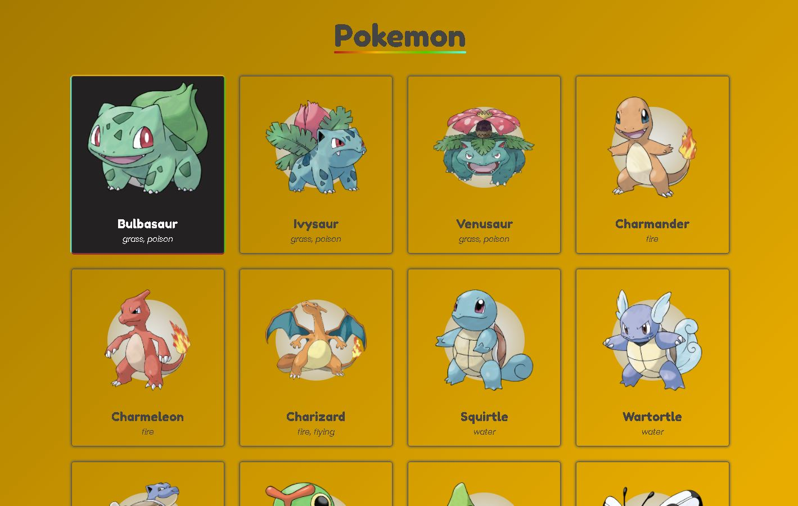

# Pokedex

**OBS: Essa projeto foi construido por mim, na minha conta conta antiga do Github que perdi o acesso dela, por isso, resolvi trazer o projeto para a conta que tenho acesso para realizar modificações.**

- Projeto original: [BernardoOficial/Pokedex](https://github.com/BernardoOficial/Pokedex)

Na época, essa aplicação foi para treinar aplicações com Javascript Vanilha, como consumir API, realizar e resolver várias promises, renderizar vários elementos em tela.

## Consumir API do PokeAPI - Apresentação

## Resultado do projeto

